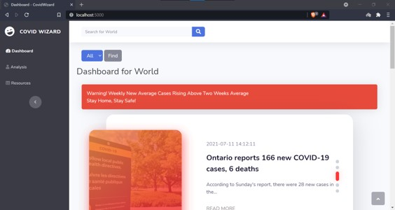
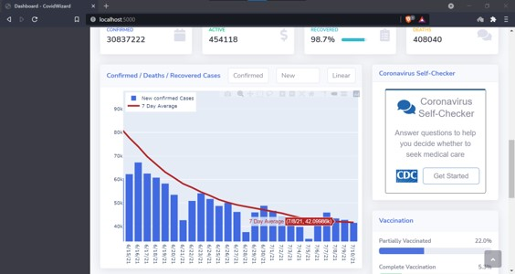
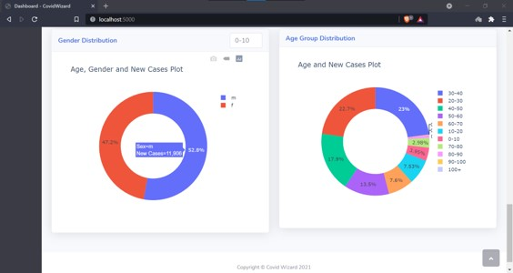
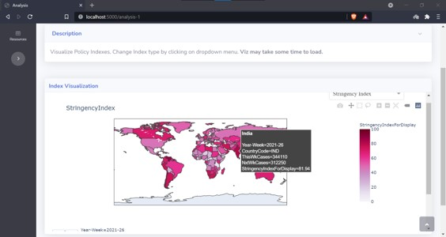

# Accenture AI Hackathon Project
# CovidWizard

[CovidWizard](https://covidwizard.herokuapp.com/) is a webapp solution for giving insights to the healthcare workers.

## Overview

This challenge presents a curated collection of datasets from global sources and asks to model solutions for the below key tasks that were developed and evaluated by a global frontline of healthcare providers, hospitals, suppliers, and policymakers.

## Task

Propose and build a solution that can help identify, predict and address pain points similar, but not limited to the sample ideas listed below:

- Predict the following:  
  - Populations that have the highest risk of contracting Covid-19.
  - Possible severity of illness in a particular patient/demographic.  

- Identify the following:  
  - Incidence of Covid-19 infection among cancer patients.
  - How the implementation of strategies impacts rates of Covid-19 infection?

## Installation

Install the required Python packages from requirements.txt.

```bash
pip install -r requirements.txt
```

## Usage

```python
1. Clone the Repository 
2. Make a new environment 
3. Install required packages from 'requirements.txt'
4. Run 'app.py'
```
## Screenshots
|    |    |
| ---| ---|
||  |
||  |

## Contributing
Pull requests are welcome. For major changes, please open an issue first to discuss what you would like to change.

Please make sure to update tests as appropriate.

## License
[MIT](https://choosealicense.com/licenses/mit/)
